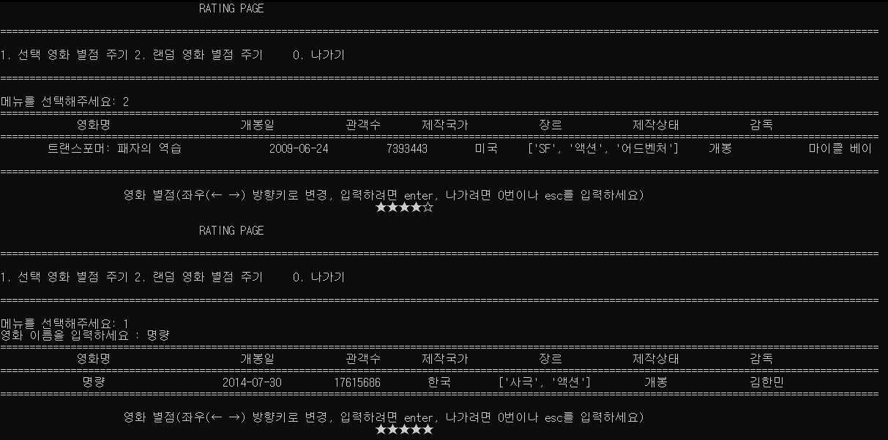
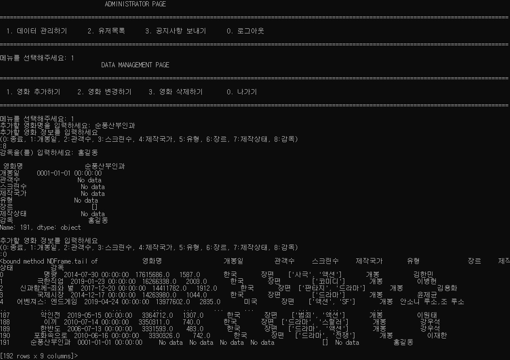

### YW_mini_project
##영화추천 프로그램

> 이 프로젝트는 영화 관람객 수, 누적 매출액, 장르, 배우, 감독, 평점 등 데이터를 읽어와서   
> 영화를 추천하는 프로그램입니다.

-----


### 영화 별점 주기

##키보드 좌우상하 방향키를 입력받아서 별점이 변화하는 알고리즘 구현



```python
def rate_movie(self, movie_data, movie):    # 영화에 별점을 부여하는 함수
   print("="*150)
   print("{:^30}{:^20}{:^10}{:^10}{:^20}{:^10}{:^20}".format("영화명", "개봉일", "관객수", "제작국가", "장르", "제작상태", "감독"))
   print("="*150)
   # 랜덤으로 정해진 영화의 정보를 출력
   print("{:^30}{:^23}{:^13}{:^12}{:^19}{:^13}{:^20}".format(movie_data.영화명, str(movie_data.개봉일.date()), str(movie_data.관객수), movie_data.제작국가, movie_data.장르, movie_data.제작상태, movie_data.감독))
   print("="*150)
   print("")
   print("{:^100}".format("영화 별점(좌우(← →) 방향키로 변경, 입력하려면 enter, 나가려면 0번이나 esc를 입력하세요)"))
   n = 3
   while True:
      print("\t\t\t\t\t\t\t\t", end='')
      print('{}{}'.format('★' * n, '☆' * (5 - n)), end='\r')
      time.sleep(0.5)
      key = str(ord(getch()))  # getch 함수로 방향키 및 엔터키를 입력받음
      if key == '75' or key == '80':  # 75(left), 80(down)
         if n != 1:
            n -= 1
      elif key == '77' or key == '72':  # 77(right), 72(up)
         if n != 5:
            n += 1
      elif key == '13':  # 13(enter)
         print("\t\t\t\t\t\t\t\t", end='')
         print('{}{}'.format('★' * n, '☆' * (5 - n)), end='\n\n')
         return n  # 영화의 별점 값(n)을 리턴
      elif key == '27' or key == '48':  # 27(esc), 48(0)
         break
```


### 기존 DB에 새로운 영화 데이터 추가하기



```python
	def add_movie_data(self, data):
	# 데이터프레임 영화데이터 추가
		sel = {1:'개봉일', 2:'관객수', 3:'스크린수', 4:'제작국가', 5:'유형', 6:'장르', 7:'제작상태', 8:'감독'}
		name = input('추가할 영화명을 입력하세요: ')
		data = data.append({'영화명': name}, ignore_index=True)
		data.at[data.index[-1],'장르'] = []		# Pandas에서 df.loc으로 list가 입력값으로 삽입되지 않을때, df.at을 사용한다
		data = data.fillna('No data')	# NaN을 모두 0으로 변경
		data.loc[data.index[-1],'개봉일'] = datetime(1, 1, 1)	# 개봉일 NaN값을 datetime 타입으로 만들기 위함
		while True:
			code = int(input('추가할 영화 정보를 입력하세요\n(0:종료, 1:개봉일, 2:관객수, 3:스크린수, 4:제작국가, 5:유형, 6:장르, 7:제작상태, 8:감독) \n:'))
			if code == 0:
				break
			elif code == 6:
				while True:
					value = input('%s을(를) 입력하세요(0:종료): ' %sel[code])
					if value == '0':
						break
					data.loc[data.index[-1], '장르'].append(str(value))	# 장르의 경우 리스트에 str타입으로 추가
			else:
				value = input('%s을(를) 입력하세요: ' %sel[code])
				data.loc[data.index[-1], sel[code]] = value
			print('\n', data.iloc[data.index[-1]], '\n')
		print(data.tail)
		return data
```
