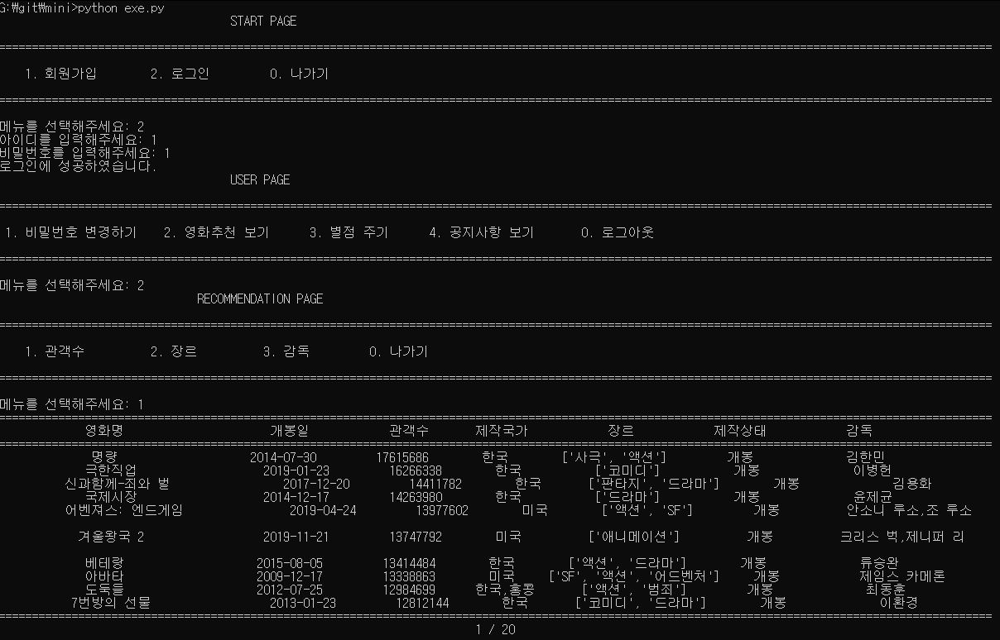

### YW_mini_project
##영화추천 프로그램

> 이 프로젝트는 영화 관람객 수, 누적 매출액, 장르, 배우, 감독, 평점 등 데이터를 읽어와서   
> 영화를 추천하는 프로그램입니다.

-----

### 관객수 기준으로 영화 추천 받기




### 영화 별점 주기

##키보드 좌우상하 방향키를 입력받아서 별점이 변화하는 알고리즘 구현


```python
def rate_movie(self, movie_data, movie):    # 영화에 별점을 부여하는 함수
   print("="*150)
   print("{:^30}{:^20}{:^10}{:^10}{:^20}{:^10}{:^20}".format("영화명", "개봉일", "관객수", "제작국가", "장르", "제작상태", "감독"))
   print("="*150)
   # 랜덤으로 정해진 영화의 정보를 출력
   print("{:^30}{:^23}{:^13}{:^12}{:^19}{:^13}{:^20}".format(movie_data.영화명, str(movie_data.개봉일.date()), str(movie_data.관객수), movie_data.제작국가, movie_data.장르, movie_data.제작상태, movie_data.감독))
   print("="*150)
   print("")
   print("{:^100}".format("영화 별점(좌우(← →) 방향키로 변경, 입력하려면 enter, 나가려면 0번이나 esc를 입력하세요)"))
   n = 3
   while True:
      print("\t\t\t\t\t\t\t\t", end='')
      print('{}{}'.format('★' * n, '☆' * (5 - n)), end='\r')
      time.sleep(0.5)
      key = str(ord(getch()))  # getch 함수로 방향키 및 엔터키를 입력받음
      if key == '75' or key == '80':  # 75(left), 80(down)
         if n != 1:
            n -= 1
      elif key == '77' or key == '72':  # 77(right), 72(up)
         if n != 5:
            n += 1
      elif key == '13':  # 13(enter)
         print("\t\t\t\t\t\t\t\t", end='')
         print('{}{}'.format('★' * n, '☆' * (5 - n)), end='\n\n')
         return n  # 영화의 별점 값(n)을 리턴
      elif key == '27' or key == '48':  # 27(esc), 48(0)
         break
```


### 기존 DB에 새로운 영화 데이터 추가하기


